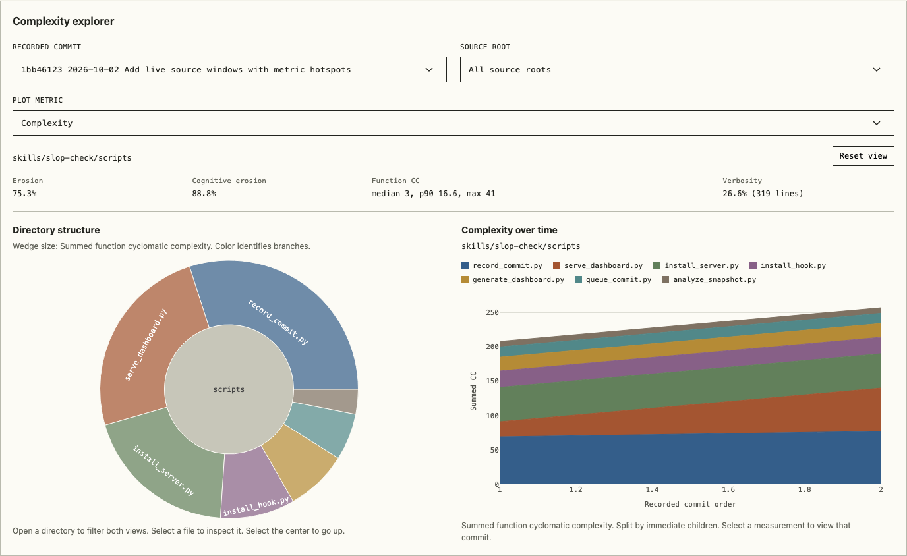
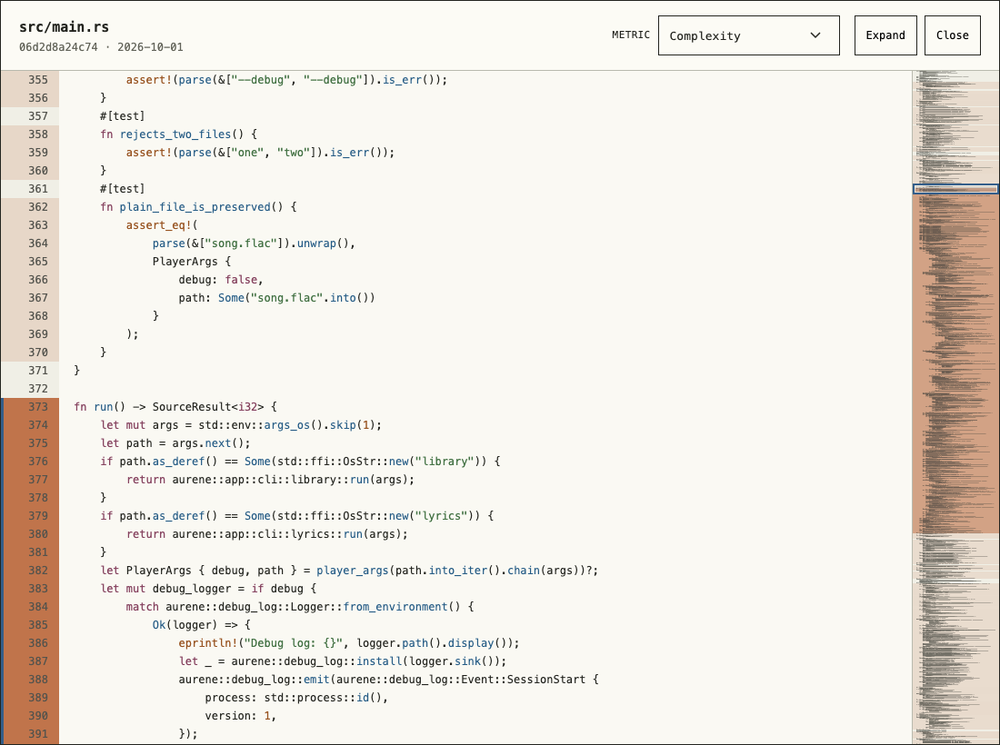

# Strata

Strata records code metrics from Git commits and displays them in a live dashboard.
It uses [scb-check](https://github.com/gabeorlanski/scb-check) to measure Python,
Rust, and JavaScript source.

Named for geological layers, Strata helps you explore how your codebase builds up
and changes over time.

Browse directories and files, follow changes across commits, and open the source
behind a measurement with syntax highlighting and metric hotspots. Source windows
show the selected commit's code, even when the working tree has changed.

[](docs/images/dashboard.png)

Strata's Python recorder and server measured across two commits.

[](docs/images/source-hotspots.png)

The source window shades function ranges by the selected metric. The minimap
shows hotspots across the file and lets you jump to them. Exact flagged-line
locations are available for measurements recorded with line details.

## Setup

Requires Git, Python 3.10+, and [uv](https://docs.astral.sh/uv/). The recorder and dashboard
scripts live in `skills/slop-check/`.

```sh
git clone https://github.com/ravila4/strata.git
cd strata
```

For a Python project with source under `src`, install the advisory commit hook and
record an initial measurement:

```sh
python3 skills/slop-check/scripts/install_hook.py \
  --repo /absolute/path/to/project --source-root src --language python
python3 skills/slop-check/scripts/record_commit.py \
  --repo /absolute/path/to/project
```

Choose `python`, `rust`, or `javascript` and the source roots for the project being
measured. The hook records future commits in the background. One Strata installation
can serve multiple projects. Application scripts and dashboard assets stay in this
installation; each project's excluded `.slop-check/` directory holds its configuration,
measurements, reports, queue state, logs, and minimal hook wrappers.

Start the live dashboard:

```sh
uv run --script skills/slop-check/scripts/serve_dashboard.py \
  --repo /absolute/path/to/project --port 8766
```

Open <http://127.0.0.1:8766/>. New measurements refresh automatically while the
dashboard is visible. Use a different port for each project served at the same time.
Measurements are advisory; they describe source structure and complexity concentration.

See [commit recording](skills/slop-check/references/commit-hook.md) for source
selection and hook behavior, and [dashboard usage](skills/slop-check/references/dashboard.md)
for navigation, persistent macOS service setup, and Tailscale access. The
[agent skill](skills/slop-check/SKILL.md) also supports snapshot comparisons.
Updates to the shared recorder apply to newly launched processes. Let active scans
finish before replacing runtime files. After updating dashboard code or assets,
restart the server and reload the browser. Keep Strata at its installed location;
if you move it, rerun each project's installers from the new location.

## Development

Run from this repository:

```sh
uv run --with pytest --with plotly==6.3.1 pytest -q skills/slop-check/tests
node --test skills/slop-check/tests/dashboard.test.cjs
uvx ruff check skills/slop-check/scripts skills/slop-check/tests
```

Browser checks require Chromium and WebKit installed through Playwright:

```sh
uv run --with playwright playwright install chromium webkit
uv run --script skills/slop-check/tests/source_browser.py
```

## Credits

[scb-check](https://github.com/gabeorlanski/scb-check), by
[Gabriel Orlanski](https://github.com/gabeorlanski), provides Strata's metric analysis.
Strata currently pins version 0.2.0 and adds commit recording and visualization
around its results.

[SlopCodeBench](https://github.com/SprocketLab/slop-code-bench), from SprocketLab,
and the [SlopCodeBench paper](https://arxiv.org/abs/2603.24755) provide the research
and metric definitions behind this project.

## License

Strata is licensed under the [MIT License](LICENSE). Bundled third-party assets
retain their own licenses in [the vendor directory](skills/slop-check/assets/vendor/).
